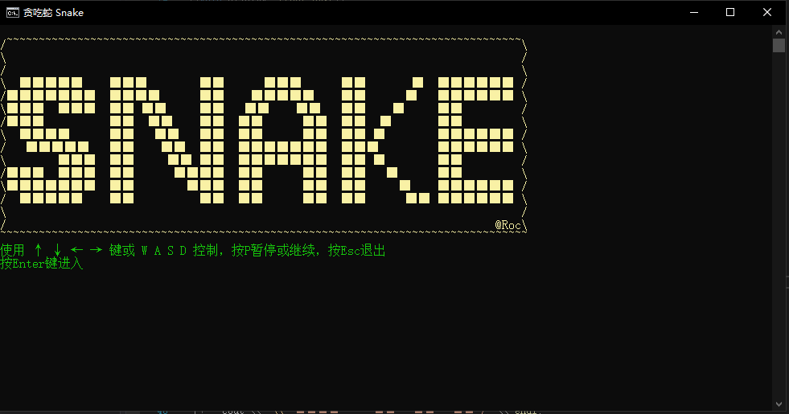
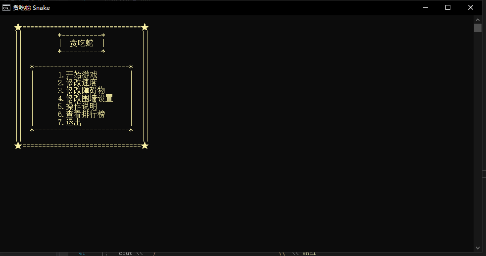
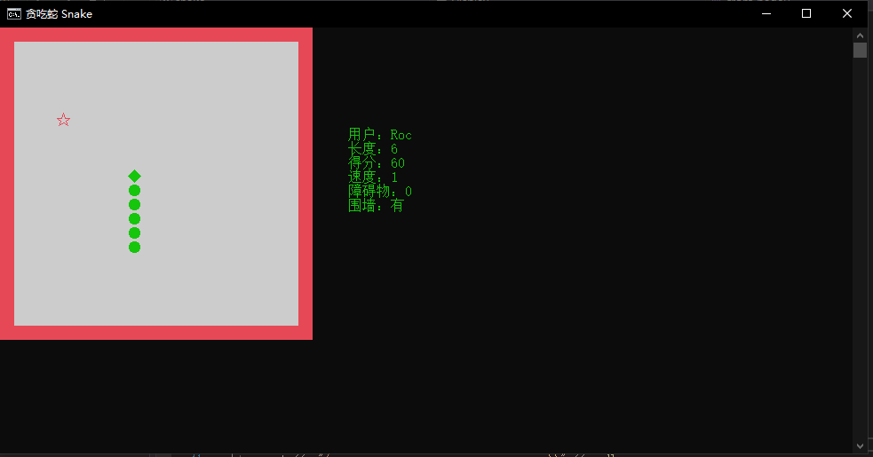
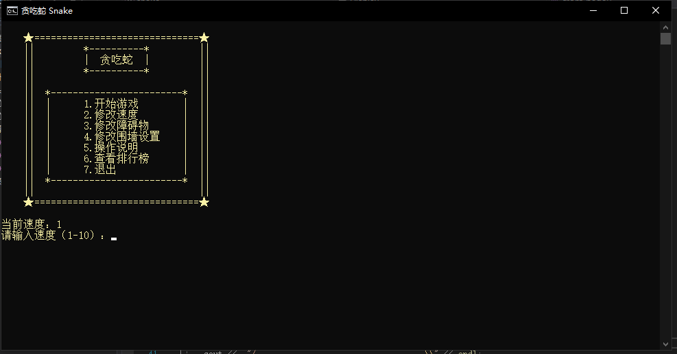
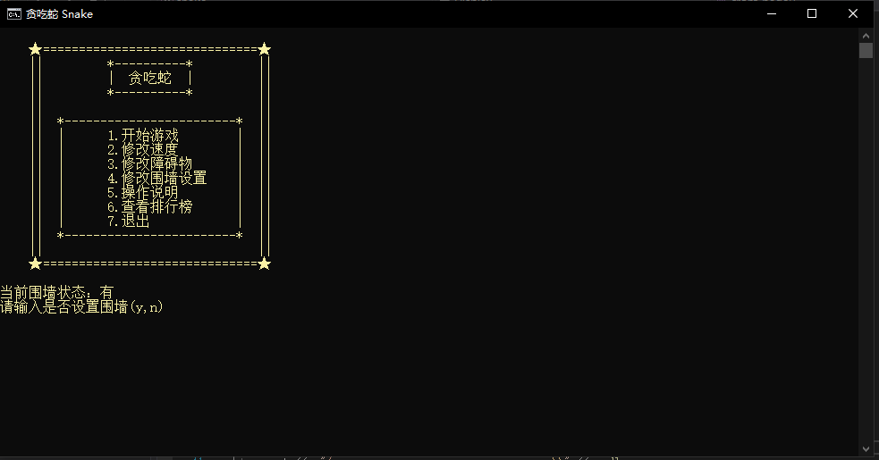
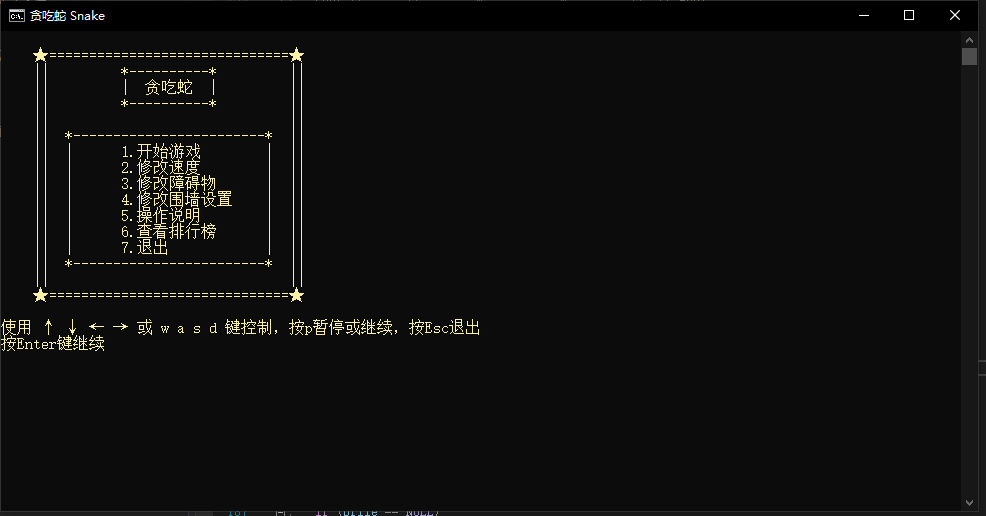
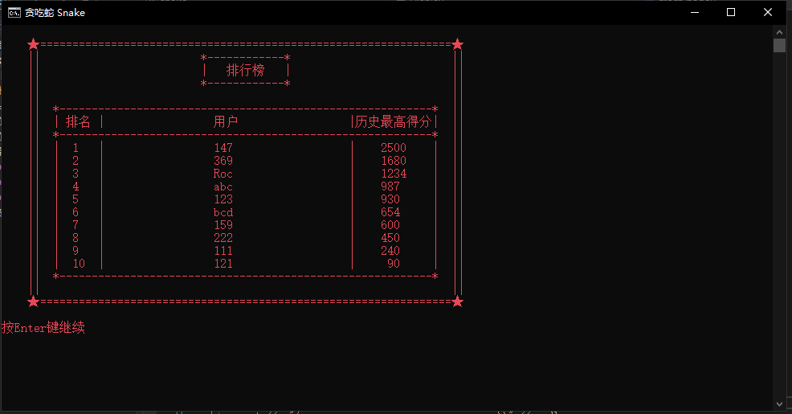

## 一、关于课程设计

### 1.主要内容

　　本次课程设计选择控制台小游戏，以经典贪吃蛇为基础参考，实现贪吃蛇的控制台版本，并添加一些特色功能。

### 2.需求分析

1. 需要实现贪吃蛇基础功能，包括：
   1. 上下左右移动
   2. 产生食物
   3. 吃掉食物
   4. 增加蛇的长度
   5. 计分
2. 需要实现其他的的功能包括：
   1. 设置围墙
   2. 产生特殊食物
   3. 给特定食物限时
   4. 设置障碍物
3. 拓展功能：
   1. 调整蛇移动的速度
   2. 设置障碍物数量
   3. 地图右侧显示状态栏，包括得分，关卡等信息
   4. 设置排行榜记录例示最高的前十

### 3.设计目标

　　复现贪吃蛇的增强版，增加自己的特色功能，并能够给用户较好的游戏体验。

### 4.设计思路

1. 存储状态
   + 用二维数组表示地图，记录地图上每一个位置的内容，如蛇身，蛇头，空白，食物，障碍物。

2. 移动
   + 捕获键盘操作`↑` `↓` `←` `→`或`w` `a` `s` `d`和`Esc`进行操作移动，如果捕获到`Esc`就退出游戏。
3. 显示
   + 使用while(1)死循环，连续进行打印，如果捕获按键就进行分析并改变状态，并判断是否游戏结束，如果结束就跳出循环。
4. 计分规则
   + 按照速度和障碍物、食物种类区分等级计分，每吃一个普通食物，得分加$(速度+障碍物数量 + 2)\times 10$，每吃一个特殊食物，得分加$(速度+障碍物数量+2) \times 20$.
5. 判断游戏状态
   + 如果蛇头的位置和食物的位置重合，则判定为吃点掉食物，如果和障碍物位置重合，则判定为游戏结束，否则继续前进。
6. 排行榜
   + 使用文件`users.txt`记录排行前十的玩家的名字，得分，排名。

<div STYLE="page-break-after: always;"></div>

## 二、类的设计

### `class snake`

1. 数据

```C++
	//游戏信息
	int statu[20][20];                 //20x20地图位置的状态，
                                       //0表示无，1表示蛇身，2表示蛇头，
	                                   //3表示食物，4表示特殊食物，5表示障碍物
	int snake[2][400];                 //记录蛇身的坐标，队列方式
                                       //2表示横纵坐标，400表示蛇身节点
	int food_x, food_y;                //食物的坐标
	int food_num;                      //已吃食物数量
	int special_food_x, special_food_y;//特殊食物的坐标
	int special_food_left_time;        //特殊食物剩余时间
	int special_food_exist;            //特殊食物是否存在
	int head_x, head_y;                //蛇头的坐标
	int head, tail;                    //头和尾在snake中的下标

	//游戏状态
	int direction;                     //方向 72上 80下 75左 77右
	int length;                        //蛇的长度
	int speed;                         //蛇移动的速度，1-10，
	                                   //延迟时间300-(int)(sqrt(speed)*90)
	int barrier_num;                   //障碍数量,0-5
	int if_fence;                      //是否有围墙
	int if_game_over;                  //是否游戏结束

	//玩家信息
	char* name;                        //名字
	int score;                         //得分 每吃一个食物
	                                   //普通食物+(speed+barrier_num+2)*10
	                                   //特殊食物+(speed+barrier_num+2)*20
	int ranking;                       //排名

	//操作
	int operation;                     //操作   
	                                   //224:72上   224:80下   
	                                   //224:75左   224:77右   
	                                   //112(p)暂停/继续  27(Esc)退出 
```

<div STYLE="page-break-after: always;"></div>

2. 操作

```C++
	//构造函数
	Snake();
	//析构函数
	~Snake();
	//初始化
	void init();
	//修改速度
	void change_speed();
	//修改障碍物数量
	void change_barrier_num();
	//修改围墙设置
	void change_fence();
	//开始游戏
	void begin();
	//产生食物
	void create_food();
	//产生特殊食物
	void create_special_food();
	//销毁特殊食物
	void destory_special_food();
	//产生障碍物
	void set_barrier();
	//改变方向,72上 78下 75左 77右
	void change_direation(int a);
	//移动，头增加，尾不动
	void move();
	//是否吃到食物，吃到加分加长度，未吃到删除尾
	void eat();
	//暂停/继续
	void pause();
	//结束游戏
	int game_over();
	//打印界面
	void draw();
	void draw_snake(int fence);
	//获取排名
	int get_ranking() const;
	//获取得分
	int get_score() const;
	//获取用户名
	const char* get_name() const;
	//保存得分
	void save_score();
```

<div STYLE="page-break-after: always;"></div>

##　三、功能特点

### 1.基础功能

1. 移动

   + 使用`↑` `↓` `←` `→`和`w` `a` `s` `d`两组操作方式，适合更多玩家。

2. 显示

   + 进入游戏欢迎界面。

     

   + 隐藏控制台光标，避免高频率清屏导致的闪烁引起不适。

   + 高亮显示障碍物，界面更清晰。

3. 特殊食物

   + 每吃掉五个普通食物就出现一个特殊食物，并停留移动30步的时间。

4. 计分规则

   + 根据游戏难度增加每个食物的分值。

### 2.拓展功能

1. 障碍物
   + 可以设置障碍物数量，开始游戏是随机在地图上产生`1X2`大小的障碍物。
2. 速度设置
   + 速度（延时）增加采取`(int)(sqrt(speed) * 90)`的方式，不至于速度等级低时太慢而速度等级高时太快。
3. 状态栏
     + 显示当前玩家昵称，长度，得分，速度，障碍物数量，围墙状态等。
4. 暂停功能
   + 额外添加暂停功能.

<div STYLE="page-break-after: always;"></div>

## 四、主要算法

### 1.移动

+ 头部坐标向移动方向增加（减少），尾部暂时不动，据需判断是否吃到食物，如果吃到食物就继续，未吃到食物就将尾部置空。

### 2.吃食物

+ 判断蛇头坐标的地图状态是否为食物，是则将其改为蛇头，将原蛇头改为蛇身，否则将蛇尾置空。

### 3.判断游戏结束

+ 判断蛇头的坐标是否为障碍物或地图外侧，是则游戏结束，否则继续。

<div STYLE="page-break-after: always;"></div>

## 五、操作手册

### 1.注意事项

+ 请尽量不要将`snake.exe`单独放到桌面运行，若放到桌面，首次打开需要以管理员身份运行（需要创建文件`users.txt`）。
+ 建议打开窗口后切换到英文输入法，避免字母按键失效。

### 2.进入

+ 打开`snake.exe`后，等待欢迎页面结束后按`Enter`进入开始界面。



### 3. 开始游戏

+ 在开始界面按 `1` 后输入昵称开始游戏，在游戏中，按`↑` `↓` `←` `→`或`w` `a` `s` `d`进行操作，按`p` 暂停，按`Esc`结束游戏。



<div STYLE="page-break-after: always;"></div>

### 4.修改速度

+ 在开始界面按 `2` 调增游戏速度，范围1-10。



### 5.修改障碍物数量

+ 在开始界面按 `3` 修改障碍物数量，范围0-5, 0即无障碍物。


<div STYLE="page-break-after: always;"></div>

### 6.修改围墙设置

+ 在开始界面按 `4` 修改围墙设置，按 `y` 改为有围墙，按 `n` 改为无围墙。



### 7.查看操作说明

+ 在开始界面按 `5` 查看操作说明。



<div STYLE="page-break-after: always;"></div>

### 8.查看排行榜

+ 在开始界面按 `6` 查看排行榜，或每局游戏结束后展示排行榜。



<div STYLE="page-break-after: always;"></div>

## 六、实现过程中的问题及解决方案

### 1.游戏过程中屏幕闪烁

1. 问题描述：

   　　由于界面实现方式为 清屏+打印新内容，控制台光标随之闪烁，造成游戏体验差

2. 解决方案：

   　　使用`windows.h`中的隐藏光标`SetConsoleCursorInfo()`函数隐藏光标。

### 2.在地图右侧打印状态栏

1. 问题描述：

   　　需在地图右侧打印状态栏，若打印地图同时打印状态栏，操作复杂，代码结构较乱，维护困难。

2. 解决方案：

   　　使用`windows.h`中的`SetConsoleCursorPosition()`函数实现光标定位，打印地图后定位到地图右侧，在打印状态栏。

### 3. 排行榜新用户无法加入

1. 问题描述：

   　　从文件中读入历史玩家到数组`users[10]`后新玩家无法加入到排行榜中。

2. 解决方案：

   　　将数组改为`users[11]`新用户加到结尾，排序后舍弃第11名。
